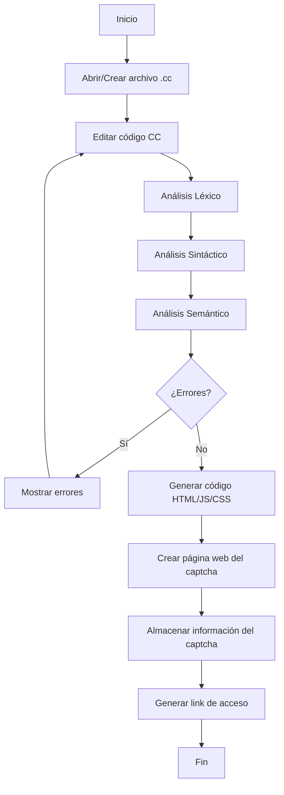
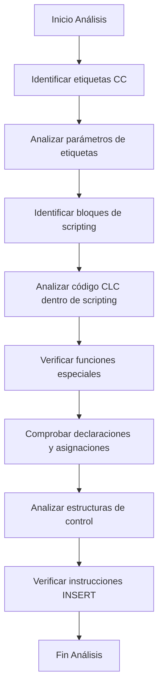
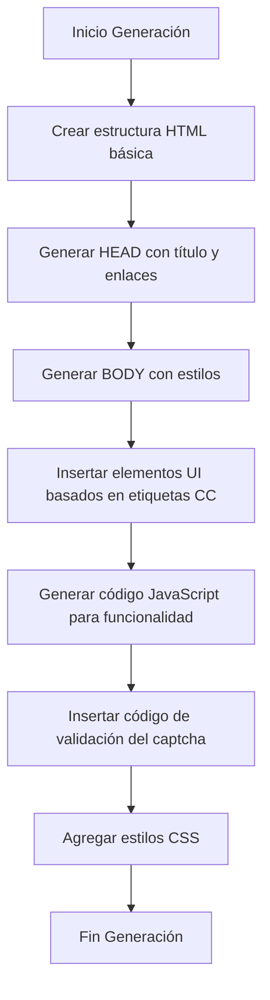
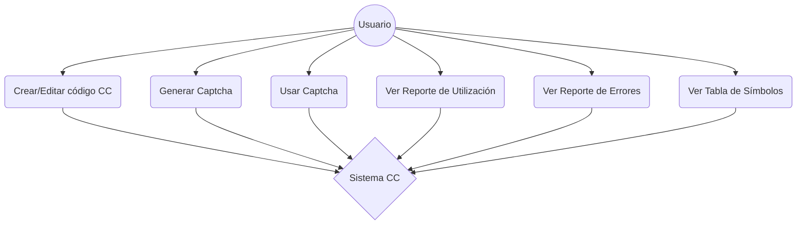
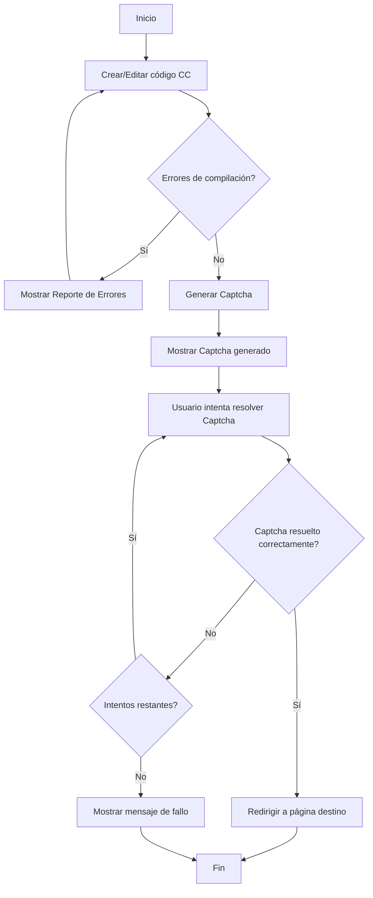
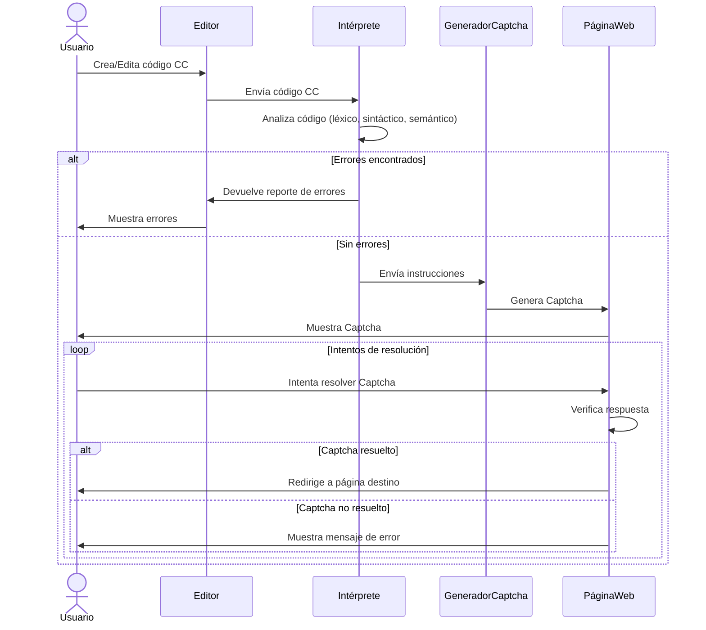

# CaptchaForge - Manual Técnico

## 🎯 Descripción

CaptchaForge es un sistema intérprete que permite la traducción de código basado en etiquetas a páginas web funcionales. El sistema tiene la capacidad de procesar código de alto nivel embebido en cualquier parte del documento y traducirlo a lenguajes web estándar (HTML, JavaScript, CSS) utilizando Angular para implementar el dinamismo requerido.

### Característica Principal
> "Se busca que estos sean traducidos a páginas web reales independientes y las cuales deberán ser desplegadas por un servidor web de acuerdo al lenguaje que se utiliza en la implementación."

### Objetivo del Intérprete
> "Se le pide implementar un intérprete que permita la traducción de un código basado en etiquetas el cual puede tener además codigo de alto nivel embebido en cualquier parte del documento, a un lenguaje entendido por los navegadores web en este caso hablamos de lenguaje HTML además de las configuraciones necesarias y el dinamismo agregado mediante lenguajes como JavaScript, CSS y Angular."

## 📊 Diagramas del Sistema

### 1. Flujo de Generación de Captcha

### 2. Flujo de Análisis

### 3. Flujo de Conversión CC a HTML

### 4. Diagrama de Interacciones

### 5. Diagrama de Actividades

### 6. Diagrama de Secuencia
